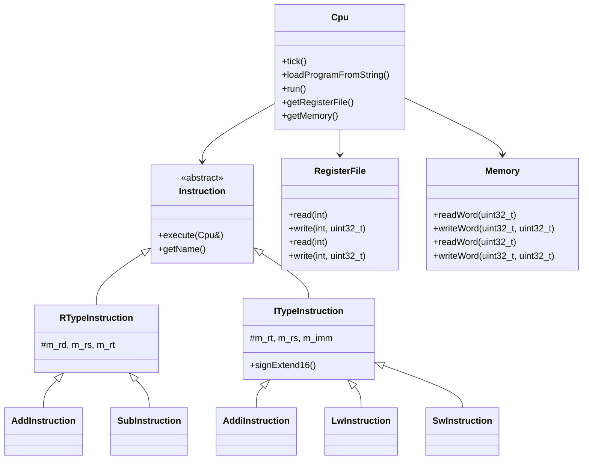

# MIPS Assembly Simulator - 開發進度報告

**日期**: 2025年7月31日  
**開發階段**: Sprint 1 - 核心 ISA 實現  
**狀態**: ✅ 完成 ADD/SUB/ADDI/LW/SW 指令，進行中

---

## 📊 專案現況

### 當前成就
- ✅ **Walking Skeleton 完成** - CMake + Google Test 建置系統正常運作
- ✅ **ADD 指令完整實現** - 包含解析、執行、測試
- ✅ **SUB 指令完整實現** - 包含解析、執行、測試
- ✅ **ADDI 指令完整實現** - I-type 立即值算術，包含符號擴展
- ✅ **LW 指令完整實現** - 記憶體載入，支援偏移尋址
- ✅ **SW 指令完整實現** - 記憶體儲存，支援偏移尋址
- ✅ **BDD 測試框架建立** - 模擬 Cucumber 場景的 Google Test 實現
- ✅ **測試覆蓋率**: 100% (27/27 測試通過)

### 架構完成度
```
✅ CPU 核心架構           (基礎完成)
✅ RegisterFile          (完成)
✅ Memory                (完成)
✅ Instruction 系統      (R-type + I-type 完成)
✅ Assembler             (ADD/SUB/ADDI/LW/SW 支援)
🔄 Pipeline 架構         (骨架完成，待實現)
❌ Hazard 處理           (未開始)
❌ 分支指令              (未開始)
❌ 跳躍指令              (未開始)
```

---

## 🏗️ 專案架構

### 目錄結構
```
MIPS-Assembly-Simulator/
├── src/                    # 原始碼
│   ├── Cpu.h/.cpp         # 主要 CPU 類別
│   ├── RegisterFile.h/.cpp # 32個暫存器管理
│   ├── Memory.h/.cpp      # 記憶體系統
│   ├── Instruction.h/.cpp # 指令類別階層
│   ├── Assembler.h/.cpp   # 簡單組譯器
│   ├── Stage.h/.cpp       # Pipeline 階段基礎
│   └── main.cpp           # CLI 主程式
├── tests/                 # 測試檔案
│   ├── test_cpu.cpp       # 基礎單元測試
│   └── test_bdd_core_instructions.cpp # BDD 風格測試
├── features/              # Gherkin 特徵檔案 (未來用於 cucumber-cpp)
│   ├── core_instructions.feature
│   └── pipeline.feature
├── build/                 # CMake 建置目錄 (gitignore)
└── .github/workflows/     # CI/CD 設定
    └── ci.yml
```

### 類別關係圖


---

## 💻 開發系統指令

### 建置系統
```powershell
# 初始設定 (只需執行一次)
cd "C:\Users\aloha\Documents\GitHub\MIPS-Assembly-Simulator"
cmake -B build -G "Visual Studio 17 2022"

# 日常開發工作流程
cmake --build build --config Debug    # 建置專案
ctest --test-dir build --output-on-failure  # 執行所有測試

# 單獨執行CLI
.\build\src\Debug\mips-sim.exe

# 清理建置 (如有問題)
rmdir /s build
cmake -B build -G "Visual Studio 17 2022"
```

### 測試指令
```powershell
# 執行所有測試
ctest --test-dir build --output-on-failure

# 執行特定測試
ctest --test-dir build -R "CoreInstructionsBDD" --output-on-failure

# 顯示測試詳細資訊
ctest --test-dir build --verbose
```

### Git 工作流程
```powershell
# 查看變更
git status
git diff

# 提交變更
git add .
git commit -m "feat: implement SUB instruction with tests"

# 推送到遠端
git push origin main
```

---

## 🐛 開發過程中遇到的問題

### 1. Cucumber-cpp 相依性問題
**問題**: FetchContent 無法抓取 cucumber-cpp v0.6.0
```
fatal: invalid reference: v0.6.0
```
**解決方案**: 暫時移除 cucumber-cpp，使用 Google Test 模擬 BDD 場景
**未來**: 需要手動安裝 cucumber-cpp 或使用較新的版本

### 2. 編譯器警告：類型轉換
**問題**: Memory.cpp 中 `std::fill` 的類型轉換警告
```cpp
// 錯誤寫法
std::fill(m_data.begin(), m_data.end(), 0);

// 正確寫法  
std::fill(m_data.begin(), m_data.end(), static_cast<uint8_t>(0));
```

### 3. 前置宣告 vs 完整定義
**問題**: Instruction.cpp 中使用 RegisterFile 但沒有包含標頭檔
```cpp
// 需要添加
#include "RegisterFile.h"
```

### 4. 管線暫存器的不完整類型
**問題**: `std::unique_ptr<PipelineRegister>` 在解構時需要完整定義
**解決方案**: 在 Cpu.h 中包含 Stage.h 而非僅前置宣告

---

## 🔧 技術細節與注意事項

### CMake 設定重點
- **C++17 標準**: 確保現代 C++ 功能支援
- **FetchContent**: 用於管理外部相依性 (Google Test)
- **Generator**: Windows 使用 Visual Studio，Linux 可用 Ninja
- **編譯選項**: 啟用所有警告 (`/W4 /WX` 或 `-Wall -Wextra -Wpedantic -Werror`)

### 測試架構設計
```cpp
// BDD 風格測試範例
TEST_F(CoreInstructionsBDD, Add_t0_t1_to_t2_3_plus_5_equals_8) {
    given_register_contains("$t0", 3);
    given_register_contains("$t1", 5);
    when_program_executed_for_cycles("add $t2, $t0, $t1", 1);
    then_register_should_equal("$t2", 8);
}
```

### 指令實現模式
1. **定義指令類別** (繼承自適當基礎類別)
2. **實現 execute() 方法**
3. **更新 Assembler 解析邏輯**
4. **撰寫 BDD 測試**
5. **確認所有測試通過**

---

## 🎯 下一階段開發指引

### 立即工作 (ADDI 指令)
1. **創建 ITypeInstruction 基礎類別**
```cpp
class ITypeInstruction : public Instruction {
protected:
    int m_rt;     // 目標暫存器
    int m_rs;     // 來源暫存器  
    int16_t m_imm; // 16位元立即值
};
```

2. **實現符號擴展**
```cpp
uint32_t signExtend16(int16_t value) {
    return static_cast<uint32_t>(static_cast<int32_t>(value));
}
```

3. **更新 Assembler 解析邏輯**
- 解析立即值 (十進位和十六進位)
- 處理負數立即值

### 中期目標 (記憶體指令)
1. **LW/SW 指令實現**
2. **記憶體對齊檢查**
3. **錯誤處理機制**

### 長期目標 (管線實現)
1. **5階段管線**: IF → ID → EX → MEM → WB
2. **危險處理**: 資料危險、控制危險、結構危險
3. **轉送單元**: 減少停頓週期

---

## 📋 品質保證檢查清單

### 每次提交前檢查
- [ ] 所有測試通過 (`ctest`)
- [ ] 編譯無警告 (`cmake --build`)
- [ ] 程式碼符合命名慣例
- [ ] 新功能有對應測試
- [ ] README 文件更新

### 程式碼品質標準
- **命名**: PascalCase (類別), camelCase (方法), m_ 前綴 (成員變數)
- **註解**: Doxygen 格式的 API 文件
- **異常處理**: 目前使用 ASSERT/EXPECT，未來考慮 C++ 異常
- **記憶體管理**: 使用 smart pointer，避免手動記憶體管理

---

## 🚀 如何開始開發

### 新開發者上手步驟
1. **克隆專案**
```powershell
git clone <repo-url>
cd MIPS-Assembly-Simulator
```

2. **建置確認**
```powershell
cmake -B build -G "Visual Studio 17 2022"
cmake --build build --config Debug
ctest --test-dir build
```

3. **選擇下一個 BDD 場景**
- 查看 `features/core_instructions.feature`
- 移除一個 `@ignore` 標籤
- 依照 RED-GREEN-REFACTOR 流程開發

4. **參考現有實現**
- 學習 ADD/SUB 指令的實現模式
- 複製類似的測試結構
- 遵循既有的架構設計

### 建議的開發順序
1. ADDI (I-type immediate arithmetic)
2. LW/SW (memory access)  
3. BEQ/J (control flow)
4. Pipeline implementation
5. Hazard handling

---

**最後更新**: 2025年7月31日  
**下一次檢查**: 實現 ADDI 指令後
