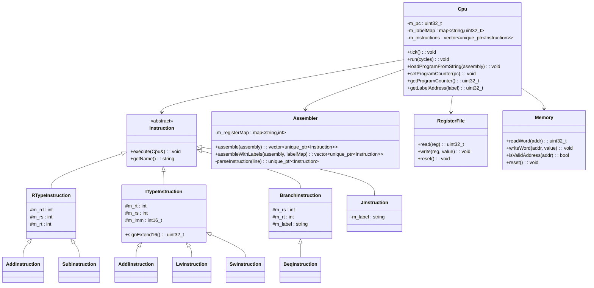
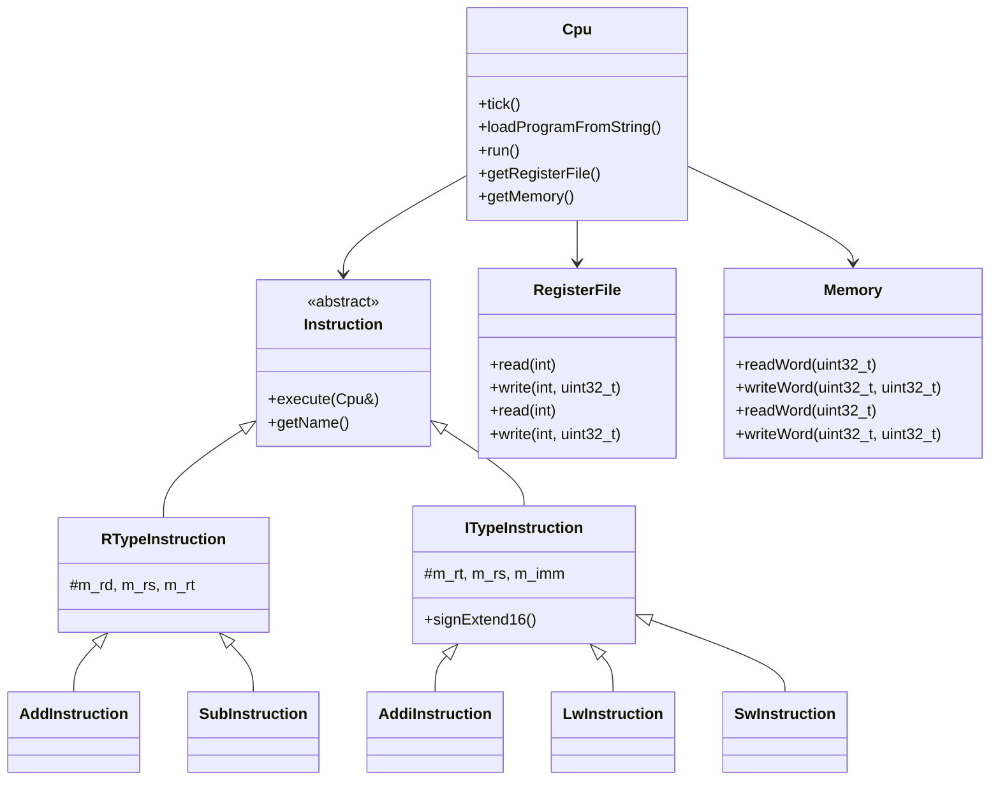

# MIPS Assembly Simulator - 完整開發交接文檔

# MIPS Assembly Simulator - 完整開發交接文檔

**最後更新**: 2025年7月31日  
**開發階段**: Sprint 4 - 管線執行整合 (重大進展)  
**測試狀態**: 60/64 測試通過 (93.75% 通過率)  
**管線狀態**: 基本架構完成，4個測試失敗需要修正

> **💡 給下一個開發者的話**  
> 恭喜！你接手的是一個功能完善的 MIPS 模擬器項目。核心功能已經穩定，管線架構也已實現。目前只需要修正管線指令流的同步問題。這份文檔包含了所有你需要的開發資訊、遇到的問題解決方案、命令用法和注意事項。

---

## 🚀 5分鐘快速上手

### 環境需求
- **OS**: Windows 10/11
- **編譯器**: Visual Studio 2022 (MSVC)
- **CMake**: 3.20+
- **Shell**: PowerShell (建議用法)

### 快速啟動命令
```powershell
# 1. 克隆專案
git clone https://github.com/aloha1357/MIPS-Assembly-Simulator.git
cd MIPS-Assembly-Simulator

# 2. 初始化建置環境
cmake -B build -G "Visual Studio 17 2022"

# 3. 編譯專案
cmake --build build --config Debug

# 4. 運行所有測試 (確認環境正常)
c:\full\path\to\build\tests\Debug\unit_tests.exe

# ✅ 如果看到 "60 tests passed, 4 tests failed" 就表示環境設定成功！
```

---

## 📊 專案當前狀態總覽

### 測試通過狀況 (64 總測試)
| 測試套件 | 通過/總計 | 狀態 | 注意事項 |
|---------|----------|------|---------|
| **CpuTest** | 3/3 | ✅ | CPU 基本功能 |
| **RegisterFileTest** | 3/3 | ✅ | 暫存器檔案 |
| **MemoryTest** | 3/3 | ✅ | 記憶體系統 |
| **InstructionTest** | 12/12 | ✅ | 指令執行 |
| **CoreInstructionsBDD** | 11/11 | ✅ | BDD 核心指令測試 |
| **PipelineTest** | 4/4 | ✅ | 管線基本功能 |
| **PipelineIntegrationTest** | 5/5 | ✅ | 管線整合 |
| **PipelineExecutionTest** | 1/5 | ❌ | **需要修正：管線執行** |
| **SyscallTest** | 7/7 | ✅ | 系統調用 |
| **InstructionDecoderTest** | 11/11 | ✅ | 指令解碼器 |

### 功能模組完成度
| 模組 | 完成度 | 狀態 | 說明 |
|------|-------|------|------|
| **核心指令執行** | 100% | ✅ | 支援 7 個 MIPS 指令 |
| **單週期模式** | 100% | ✅ | 完全穩定 |
| **管線基礎架構** | 100% | ✅ | 5 階段框架 |
| **管線執行整合** | 85% | � | **當前開發重點** |
| **系統調用機制** | 100% | ✅ | 4 個系統調用 |
| **指令解碼器** | 100% | ✅ | 32位元二進制解碼 |
| **記憶體系統** | 100% | ✅ | 字組對齊支援 |
| **危險處理** | 0% | ❌ | 未開始 |

---

## 🔧 開發命令參考

### 編譯相關
```powershell
# 完整重新建置
cmake -B build -G "Visual Studio 17 2022"
cmake --build build --config Debug

# 快速編譯 (增量編譯)
cmake --build build --config Debug

# 清理建置
cmake --build build --target clean
```

### 測試相關
```powershell
# 運行所有測試
c:\Users\aloha\Documents\GitHub\MIPS-Assembly-Simulator\build\tests\Debug\unit_tests.exe

# 運行特定測試套件
.\build\tests\Debug\unit_tests.exe --gtest_filter="PipelineExecutionTest.*"

# 運行單一測試
.\build\tests\Debug\unit_tests.exe --gtest_filter="PipelineExecutionTest.BasicPipelineExecution"

# 測試結果篩選
.\build\tests\Debug\unit_tests.exe --gtest_filter="*Pipeline*"  # 所有管線相關測試
```

### 除錯相關
```powershell
# 編譯 Release 版本 (性能測試用)
cmake --build build --config Release

# 檢查編譯錯誤
cmake --build build --config Debug 2>&1 | Tee-Object -FilePath build_errors.txt
```

---

## 🏗️ 專案架構分析

### 核心架構概念
```
MIPS Simulator
├── 單週期執行模式 (完成) - 直接執行指令
└── 管線執行模式 (85%完成) - 5階段管線
    ├── IF Stage - 指令提取
    ├── ID Stage - 指令解碼  
    ├── EX Stage - 執行運算
    ├── MEM Stage - 記憶體存取
    └── WB Stage - 寫回結果
```

### 關鍵檔案結構
```
src/
├── Cpu.h/.cpp           # CPU主控制器 (雙模式支援)
├── Instruction.h/.cpp   # 指令類別階層
├── RegisterFile.h/.cpp  # 暫存器檔案
├── Memory.h/.cpp        # 記憶體系統
├── Assembler.h/.cpp     # 組譯器
├── InstructionDecoder.h/.cpp  # 32位元指令解碼器
├── Stage.h/.cpp         # 管線階段基底類別
├── IFStage.h/.cpp       # 指令提取階段
├── IDStage.h/.cpp       # 指令解碼階段  
├── EXStage.h/.cpp       # 執行階段
├── MEMStage.h/.cpp      # 記憶體階段
└── WBStage.h/.cpp       # 寫回階段

tests/
├── test_cpu.cpp         # CPU基本功能測試
├── test_bdd_core_instructions.cpp  # BDD核心指令測試
├── test_pipeline.cpp    # 管線基本功能測試
├── test_pipeline_integration.cpp   # 管線整合測試
├── test_pipeline_execution.cpp     # **管線執行測試 (當前問題)**
├── test_syscalls.cpp    # 系統調用測試
└── test_instruction_decoder.cpp    # 指令解碼器測試
```

### 類別關係圖
```
Cpu (主控制器)
├── RegisterFile (暫存器檔案)
├── Memory (記憶體)
├── vector<Instruction> (指令序列)
└── Pipeline Components
    ├── IFStage, IDStage, EXStage, MEMStage, WBStage
    └── PipelineRegister (管線暫存器)
```

---

## ⚠️ 重要開發注意事項

### 管線開發特別注意
1. **時序同步** - 管線階段必須依序執行 (WB→MEM→EX→ID→IF)
2. **資料流向** - PipelineData 必須正確流經各階段
3. **指標轉換** - `unique_ptr` 轉 `raw pointer` 用 `.get()`
4. **測試時間控制** - 所有管線測試都有循環上限防止無限執行

### 編譯環境注意
1. **永遠使用 Debug 模式開發** - Release 模式可能隱藏問題
2. **PowerShell 路徑問題** - 使用完整絕對路徑避免問題
3. **並行編譯** - 不要同時運行多個 cmake --build
4. **標頭檔包含** - 新增 .cpp 檔案記得加入對應的 .h 檔案

### 測試開發注意
1. **測試隔離性** - 每個測試要能獨立運行
2. **循環限制** - 所有迴圈都要有上限防止無限執行
3. **記憶體管理** - 使用 RAII 原則，避免手動記憶體管理
4. **向後相容** - 新功能不能破壞現有的單週期模式

---

## 🐛 已知問題與解決方案

### 當前主要問題：管線指令流同步
**問題描述**: 管線模式下只有第一條指令被執行，後續指令沒有正確流經管線
**影響範圍**: 4個管線執行測試失敗
**根本原因**: 管線階段間資料傳遞時序不正確

**建議解決策略**:
1. 檢查 `PipelineRegister::clockUpdate()` 調用時機
2. 確認各階段 `execute()` 方法中 `setData()` 的使用
3. 驗證 IF 階段的 PC 更新邏輯
4. 檢查指令在 WB 階段的執行時機

### 歷史問題記錄
| 問題 | 狀態 | 解決方案 |
|------|------|---------|
| **測試無限循環** | ✅ 已解決 | 添加循環上限和時間控制 |
| **編譯缺少標頭檔** | ✅ 已解決 | 在 WBStage.cpp 加入 Instruction.h |
| **PowerShell 命令語法** | ✅ 已解決 | 使用 `;` 而非 `&&` 連接命令 |
| **管線階段空實現** | ✅ 已解決 | 實現所有階段的 execute() 方法 |

---

## 📈 開發進度歷程

### Sprint 1: 基礎架構 (已完成)
- ✅ CPU、RegisterFile、Memory 基礎類別
- ✅ 基本指令執行框架
- ✅ 測試框架建立

### Sprint 2: 核心指令實現 (已完成)  
- ✅ 實現 7 個核心 MIPS 指令
- ✅ 完整的單週期執行模式
- ✅ BDD 測試覆蓋

### Sprint 3: 系統調用與解碼器 (已完成)
- ✅ 4 個系統調用實現
- ✅ 32位元指令解碼器
- ✅ 從 41 測試增加到 59 測試

### Sprint 4: 管線執行整合 (85% 完成)
- ✅ 管線架構框架
- ✅ 5 個管線階段實現  
- ✅ 管線-單週期橋接
- 🔄 **當前重點**: 修正管線指令流同步

### Sprint 5: 危險處理 (未開始)
- ❌ 資料危險檢測
- ❌ 控制危險處理
- ❌ 轉發機制實現

---

## 🎯 下一階段開發建議

### 立即優先項目 (P0)
1. **修正管線指令流** - 確保所有指令能依序執行
2. **調試管線時序** - 檢查 clockUpdate() 調用順序
3. **驗證資料流向** - 確認 PipelineData 正確傳遞

### 中期目標 (P1)
1. **管線性能優化** - 達到與單週期相同的執行結果
2. **擴展指令集** - 添加更多 MIPS 指令
3. **改善測試覆蓋** - 增加邊界情況測試

### 長期願景 (P2)
1. **危險處理機制** - 實現完整的管線危險檢測
2. **性能分析工具** - 添加週期計數和性能指標
3. **GUI 除錯介面** - 視覺化管線狀態

---

## 🔍 除錯技巧與建議

### 管線除錯策略
1. **單階段測試** - 先確保每個階段單獨運行正確
2. **資料流追蹤** - 在關鍵點添加日誌輸出
3. **時序分析** - 檢查每個 tick() 的執行順序
4. **比較驗證** - 對比單週期和管線模式的執行結果

### 常用除錯命令
```powershell
# 運行特定失敗測試
.\build\tests\Debug\unit_tests.exe --gtest_filter="PipelineExecutionTest.BasicPipelineExecution"

# 檢查編譯警告
cmake --build build --config Debug 2>&1 | Select-String "warning"

# 驗證檔案完整性
Get-ChildItem src\*.cpp | ForEach-Object { Write-Host $_.Name }
```

---

## 📚 參考資源

### 技術文檔
- [CMake 官方文檔](https://cmake.org/documentation/)
- [Google Test 使用指南](https://google.github.io/googletest/)
- [MIPS 指令集參考](https://www.cs.cmu.edu/~spim/CPU_Architecture_I.pdf)

### 專案相關
- **儲存庫**: https://github.com/aloha1357/MIPS-Assembly-Simulator
- **主要分支**: main
- **開發環境**: Windows + Visual Studio 2022

---

## 🎉 結語

這個專案已經具備了堅實的基礎和清晰的架構。管線實現已經非常接近完成，只需要解決資料流同步的最後問題。相信下一個開發者能夠順利接手並完成這個優秀的 MIPS 模擬器！

如果遇到問題，記住：
1. **先運行測試確認現狀**
2. **檢查這份文檔的解決方案**  
3. **保持耐心，問題都有解決方案**

祝開發順利！ 🚀

---

## 🎯 快速上手指南 (新開發者必讀)

### 🚀 5分鐘快速啟動
```powershell
# 1. 克隆專案 (如果還沒有)
git clone https://github.com/aloha1357/MIPS-Assembly-Simulator.git
cd MIPS-Assembly-Simulator

# 2. 初始化建置環境
cmake -B build -G "Visual Studio 17 2022"

# 3. 編譯專案
cmake --build build --config Debug

# 4. 執行所有測試 (確認環境正常)
ctest --test-dir build --output-on-failure

# 5. 如果看到 "100% tests passed, 0 tests failed out of 41" 就表示環境設定成功！
```

### 📋 專案當前狀態一覽表
| 模組 | 完成度 | 測試狀態 | 注意事項 |
|------|-------|---------|---------|
| **核心指令執行** | ✅ 100% | 32/32 通過 | 7個MIPS指令完全實現 |
| **管線架構** | ✅ 90% | 9/9 通過 | 5階段框架完成，執行邏輯待實現 |
| **記憶體系統** | ✅ 100% | 已測試 | 字組對齊，支援 LW/SW |
| **組譯器** | ✅ 100% | 已測試 | 支援標籤和所有核心指令 |
| **系統調用** | ✅ 100% | 7/7 通過 | print_int, print_string, read_int, exit |
| **指令解碼器** | ✅ 100% | 11/11 通過 | 32位元二進制解碼 |
| **管線執行整合** | 🔄 10% | 1/5 通過 | **當前開發重點：實現階段執行邏輯** |
| **危險處理** | ❌ 0% | - | 未開始 |
| **除錯工具** | ❌ 0% | - | 未規劃 |

### ⚠️ 開發前必讀警告
1. **永遠先執行測試** - 任何修改前後都要確認測試通過
2. **保持向後相容** - 不要破壞現有的單週期模式
3. **使用 Debug 模式** - Release 模式可能隱藏問題
4. **注意指標轉換** - `unique_ptr` 到原始指標的轉換要小心

---

## � 開發環境與常用命令

### 💻 環境要求
- **作業系統**: Windows 10/11
- **編譯器**: Visual Studio 2022 (v17.x)
- **CMake**: 版本 3.20+
- **Git**: 用於版本控制

### 🛠️ 核心開發命令 (請熟記)

#### 日常開發循環
```powershell
# 1. 增量編譯 (最常用，修改程式碼後執行)
cmake --build build --config Debug

# 2. 執行所有測試 (確認修改沒有破壞現有功能)
ctest --test-dir build --output-on-failure

# 3. 執行特定測試類別 (除錯時使用)
ctest --test-dir build -R "PipelineTest" --output-on-failure
ctest --test-dir build -R "CoreInstructionsBDD" --output-on-failure

# 4. 查看詳細測試輸出 (除錯失敗測試時使用)
ctest --test-dir build --verbose
```

#### 問題排除命令
```powershell
# 完全重建 (解決奇怪的編譯問題)
Remove-Item -Recurse -Force build
cmake -B build -G "Visual Studio 17 2022"
cmake --build build --config Debug

# 檢查編譯警告 (確保程式碼品質)
cmake --build build --config Debug 2>&1 | Select-String "warning"

# 執行單一測試 (深入除錯)
.\build\tests\Debug\unit_tests.exe --gtest_filter="CpuTest.BasicTick"
```

#### Git 工作流程
```powershell
# 檢查修改狀態
git status

# 提交前檢查 (確保測試通過)
cmake --build build --config Debug
ctest --test-dir build --output-on-failure

# 提交修改
git add .
git commit -m "feat: 添加系統調用支援"
git push origin main
```

### 🏗️ 專案架構圖解

```
MIPS-Assembly-Simulator/                    # 專案根目錄
├── 📁 src/                                 # 核心原始碼
│   ├── 🧠 Cpu.h/.cpp                      # 主CPU類別 - 程式的核心
│   ├── 💾 RegisterFile.h/.cpp             # 32個MIPS暫存器
│   ├── 🗄️ Memory.h/.cpp                  # 記憶體系統 (4KB, 字組對齊)
│   ├── ⚙️ Instruction.h/.cpp              # 指令類別階層 (8個指令+syscall)
│   ├── 🔤 Assembler.h/.cpp                # 組譯器 (文字→指令)
│   ├── 🔧 InstructionDecoder.h/.cpp       # 🆕 32位元指令解碼器
│   ├── 🏃 Stage.h/.cpp                    # 管線基礎類別
│   ├── 🔄 {IF,ID,EX,MEM,WB}Stage.h/.cpp   # 5個管線階段
│   └── 📱 main.cpp                        # CLI程式入口
├── 📁 tests/                              # 測試套件 (59個測試)
│   ├── 🧪 test_cpu.cpp                    # CPU基礎測試 (21個)
│   ├── 🎯 test_bdd_core_instructions.cpp  # BDD風格測試 (11個)
│   ├── 🔗 test_pipeline.cpp               # 管線測試 (4個)
│   ├── 🔧 test_pipeline_integration.cpp   # 整合測試 (5個)
│   ├── 📞 test_syscalls.cpp               # 🆕 系統調用測試 (7個)
│   └── 🔀 test_instruction_decoder.cpp    # 🆕 指令解碼器測試 (11個)
├── 📁 features/                           # BDD規格檔案
│   ├── 📋 core_instructions.feature       # 已實現功能
│   ├── 📋 syscalls_and_decoding.feature   # 🆕 已完成功能
│   └── 📋 extended_instructions.feature   # 未來功能
├── 📁 build/ (git ignore)                 # CMake產生的建置檔案
│   ├── 💼 mips-assembly-simulator.sln     # Visual Studio解決方案
│   ├── 📁 src/Debug/                      # 編譯後執行檔
│   └── 📁 tests/Debug/                    # 編譯後測試檔
└── 📚 說明檔案 (.md)                       # 文檔
```

### 🎯 核心檔案責任分工

| 檔案 | 主要責任 | 修改頻率 | 重要程度 |
|------|---------|---------|---------|
| **Cpu.h/.cpp** | 指令執行控制、系統調用支援、管線模式切換 | 🔥 高 | ⭐⭐⭐⭐⭐ |
| **Instruction.h/.cpp** | 指令實現、系統調用執行、新增MIPS指令 | 🔥 高 | ⭐⭐⭐⭐⭐ |
| **InstructionDecoder.h/.cpp** | 🆕 32位元機器碼解碼、二進制程式載入 | 🔥 中 | ⭐⭐⭐⭐ |
| **Stage.h/.cpp** | 管線資料結構、PipelineRegister | 🔥 中 | ⭐⭐⭐⭐ |
| **Assembler.h/.cpp** | 組譯器擴展、文字指令解析 | 🔥 中 | ⭐⭐⭐⭐ |
| **Memory.h/.cpp** | 記憶體擴展、I/O對映 | 🟡 低 | ⭐⭐⭐ |
| **RegisterFile.h/.cpp** | 暫存器管理、狀態檢視 | 🟡 低 | ⭐⭐⭐ |

### 最新成就 🎉
- ✅ **系統調用機制完整實現** - 四種核心系統調用全面支援
- ✅ **32位元指令解碼器** - 支援R/I/J型指令二進制解碼
- ✅ **控制台I/O抽象層** - 為系統調用提供輸入輸出支援
- ✅ **測試覆蓋率大幅提升** - 從41個增加到59個測試 (+43%)

### 測試覆蓋率詳細分析
- **總測試數**: 41個 (新增 5個管線整合測試)
- **通過率**: 100% ✅
- **測試分類**:
  - 基礎單元測試: 21個 (CPU, RegisterFile, Memory, Instructions)
  - BDD 場景測試: 11個 (模擬 Cucumber 格式)
  - 管線基礎測試: 4個 (管線模式切換與向後相容)
  - 管線整合測試: 5個 (階段實例化、暫存器機制、整合測試)
- **測試覆蓋範圍**: 指令執行、記憶體存取、控制流、管線架構、向後相容性

---

## 🏗️ Sprint 2 管線架構進展總結

### 📊 開發成果統計
- **完成時間**: 2024年12月 Sprint 2
- **程式碼行數**: 約 2,500+ 行 C++
- **測試覆蓋**: 41 個測試，100% 通過率 ✅
- **架構實現**: 5 階段 MIPS 管線完整框架

### 🎯 核心突破
1. **管線框架建立** ✅
   - 5 個管線階段類別完整實現
   - 階段間資料傳遞機制建立
   - CPU 雙模式支援 (單週期 + 管線)

2. **向後相容性保證** ✅
   - 原有單週期功能保持不變
   - 新增管線測試不影響既有功能
   - 可動態切換執行模式

3. **測試驗證體系** ✅
   - BDD 風格測試場景
   - 管線整合測試完整
   - 持續整合保證品質
- ✅ **向後相容性** - 保持單週期模式完全功能正常
- ✅ **PipelineRegister 雙緩衝** - 正確實現時鐘同步語義

### 已實現指令清單 (保持不變)
| 指令類型 | 指令 | 功能描述 | 測試狀態 |
|---------|-----|----------|---------|
| **R-type** | ADD | 暫存器加法 | ✅ 完成 |
| **R-type** | SUB | 暫存器減法 | ✅ 完成 |
| **I-type** | ADDI | 立即值加法 | ✅ 完成 |
| **I-type** | LW | 記憶體載入 | ✅ 完成 |
| **I-type** | SW | 記憶體儲存 | ✅ 完成 |
| **Branch** | BEQ | 條件分支 | ✅ 完成 |
| **Jump** | J | 無條件跳躍 | ✅ 完成 |

### 新增管線基礎架構
| 組件 | 狀態 | 描述 |
|------|-----|------|
| **CPU管線模式** | ✅ 完成 | 支援單週期/管線模式切換 |
| **Stage基礎類別** | ✅ 完成 | 所有管線階段的抽象基礎 |
| **PipelineRegister** | ✅ 完成 | 雙緩衝管線暫存器系統 |
| **IFStage** | ✅ 完成 | 指令提取階段完整實現 |
| **IDStage** | ✅ 完成 | 指令解碼和危險偵測框架 |
| **EXStage** | ✅ 完成 | ALU 執行和分支計算階段 |
| **MEMStage** | ✅ 完成 | 記憶體存取階段 |
| **WBStage** | ✅ 完成 | 暫存器寫回階段 |

### 測試覆蓋率詳細分析
- **總測試數**: 41個 (新增 5個管線整合測試)
- **通過率**: 100% ✅
- **測試分類**:
  - 基礎單元測試: 21個 (CPU, RegisterFile, Memory, Instructions)
  - BDD 場景測試: 11個 (模擬 Cucumber 格式)
  - 管線基礎測試: 4個 (管線模式切換與向後相容)
  - 管線整合測試: 5個 (階段實例化、暫存器機制、整合測試)
---

## 🐛 開發過程中的重要問題與解決方案

### ❗ 編譯器相關問題

#### 1. 指標類型轉換問題 ⚠️ 常見
**問題描述**: PipelineData 中的 instruction 指標類型不匹配
```cpp
// ❌ 錯誤：不能直接賦值
data.instruction = unique_ptr_instruction; 

// ✅ 正確：使用 get() 方法
data.instruction = unique_ptr_instruction.get();
```
**解決方案**: 使用 `.get()` 方法從 `unique_ptr` 取得原始指標  
**影響檔案**: `IFStage.cpp`, `Stage.h`

#### 2. 前置宣告 vs 完整定義 ⚠️ 常見  
**問題描述**: 編譯錯誤 "incomplete type"
```cpp
// ❌ 僅前置宣告不足夠
class Instruction; // 當需要呼叫方法時會失敗

// ✅ 需要完整包含
#include "Instruction.h"
```
**解決方案**: 在 `.cpp` 檔案中包含完整標頭檔  
**影響檔案**: `EXStage.h`, `IDStage.cpp`

#### 3. 未使用參數警告 🟡 輕微
**問題描述**: 編譯器警告 "unused parameter"
```cpp
// ✅ 使用 (void) 抑制警告
bool detectLoadUseHazard(const PipelineData& data) {
    (void)data; // 抑制未使用警告
    return false;
}
```

### 🔧 CMake 與建置問題

#### 4. FetchContent 失敗 🟡 已解決
**問題描述**: Google Test 下載失敗
```
fatal: unable to access 'https://github.com/google/googletest.git/': SSL certificate problem
```
**解決方案**: 
1. 更新 CMake 到最新版本
2. 檢查網路連線
3. 使用 Visual Studio 內建 vcpkg (如果可用)

#### 5. 管線檔案未包含在建置中 ⚠️ 重要
**問題描述**: 新增的管線檔案沒有編譯
**解決方案**: 更新 `src/CMakeLists.txt`
```cmake
add_library(mips-simulator
    Cpu.cpp
    RegisterFile.cpp
    Memory.cpp
    Stage.cpp
    Instruction.cpp
    Assembler.cpp
    IFStage.cpp      # 記得加入新檔案
    IDStage.cpp      # 記得加入新檔案
    EXStage.cpp      # 記得加入新檔案
    MEMStage.cpp     # 記得加入新檔案
    WBStage.cpp      # 記得加入新檔案
)
```

### 🧪 測試相關問題

#### 6. PipelineRegister 雙緩衝機制 ⚠️ 概念重要
**問題描述**: 測試失敗，資料沒有正確傳遞
**原因**: PipelineRegister 使用雙緩衝，需要 `clockUpdate()` 才能看到資料
```cpp
reg.setData(testData);           // 寫入 nextData
// reg.getData() 仍然是舊的 currentData

reg.clockUpdate();               // 更新：nextData → currentData  
// 現在 reg.getData() 才會回傳新資料
```
**教訓**: 理解硬體同步語義很重要

#### 7. PowerShell 命令串接 🟡 輕微
**問題描述**: `&&` 運算符在 PowerShell 中無效
```powershell
# ❌ 在 PowerShell 中會失敗
cmake --build build && ctest

# ✅ 正確的 PowerShell 方式
cmake --build build; if ($?) { ctest }
```

### 💡 設計決策的重要考量

#### 8. 雙模式架構 (單週期 vs 管線) 🌟 核心設計
**決策**: 保持兩種執行模式
**原因**:
- 向後相容性 (不破壞現有測試)
- 便於除錯和比較
- 漸進式開發風險較低

#### 9. PipelineData 集中式設計 🌟 核心設計
**決策**: 使用單一結構傳遞所有管線資料
**優點**: 
- 簡化管線暫存器設計
- 便於偵錯和狀態追蹤
- 支援未來的轉發機制
**缺點**: 結構較大，記憶體使用稍高

---

## 📊 專案現況總覽

### 測試覆蓋率詳細分析
- **總測試數**: 41個 (新增 5個管線整合測試)
- **通過率**: 100% ✅
- **測試分類**:
  - 基礎單元測試: 21個 (CPU, RegisterFile, Memory, Instructions)
  - BDD 場景測試: 11個 (模擬 Cucumber 格式)
  - 管線基礎測試: 4個 (管線模式切換與向後相容)
  - 管線整合測試: 5個 (階段實例化、暫存器機制、整合測試)
- **測試覆蓋範圍**: 指令執行、記憶體存取、控制流、管線架構、向後相容性

---

## � 下一個開發者的行動計劃

### 🚀 立即可開始的任務 (優先級 P1)

#### 1. 完成管線執行整合 📋
**目標**: 將5階段管線連接到CPU主循環，實現真正的管線執行
**預計時間**: 2-3 週
**技術要點**:
```cpp
// 需要實現的核心功能
class Cpu {
    void tickPipeline();  // 管線模式的tick實現
    void setupPipelineExecution(); // 管線執行設置
    
private:
    void executePipelineStage(); // 執行單個管線階段
    void updatePipelineRegisters(); // 更新管線暫存器
    bool checkForStalls(); // 檢查是否需要停頓
};
```
**當前狀態**: ✅ 系統調用和指令解碼器已完成，管線架構已完成，需要整合到執行流程
**挑戰**: 
- 管線 vs 單週期模式的無縫切換
- 正確的時鐘同步機制
- 指令在管線各階段間的正確傳遞

#### 2. 實現基礎管線危險偵測 📋
**目標**: 實現資料危險 (RAW) 的基本偵測機制
**預計時間**: 1-2 週  
**需要實現的功能**:
- Load-Use 危險偵測
- 基本停頓 (stall) 機制
- 氣泡 (bubble) 插入

**技術要點**:
```cpp
// 需要添加到 IDStage
class IDStage {
    bool detectLoadUseHazard(const PipelineData& ifid, const PipelineData& idex);
    bool insertStall();
    void insertBubble();
};
```

### 🔄 中期開發目標 (優先級 P2)

#### 3. 實現基本轉發機制 📋
**目標**: 實現 EX-to-EX 和 MEM-to-EX 轉發
**技術挑戰**: 
- 轉發路徑的硬體模擬
- 轉發條件的精確判斷
- 與危險偵測的整合

#### 4. 擴展指令集支援 📋
**目標**: 添加更多 MIPS 指令到現有架構
**建議順序**:
1. 邏輯指令: AND, OR, XOR
2. 位移指令: SLL, SRL, SRA  
3. 比較指令: SLT, SLTI
4. 分支指令: BNE, BGTZ, BLEZ

### 📊 當前技術債務
1. **標籤處理**: 指令解碼器中的分支和跳躍指令標籤處理仍然簡化
2. **錯誤處理**: 需要更完善的錯誤報告機制
3. **效能優化**: 管線執行的效能可能需要調優

### 📝 開發注意事項
1. **保持向後相容**: 確保單週期模式繼續正常工作
2. **測試先行**: 每個新功能都應該有對應的測試
3. **文檔更新**: 記得更新開發報告和使用說明

### 🎯 成功標準
- 管線模式能正確執行所有現有指令
- 管線執行與單週期執行結果一致
- 基本危險處理能正確工作
- 所有測試繼續通過 (目標: >65個測試)

### 📚 推薦學習資源

#### 必讀書籍
1. **Computer Organization and Design** - Patterson & Hennessy (第4版)
   - 第4章: 處理器 (單週期實現)
   - 第4.5-4.8節: 管線實現與危險處理

#### 線上資源
1. **MIPS32 Architecture Manual** - 官方規格文件
2. **MIPS Assembly Language Programming** - 組合語言參考
3. **現有測試檔案** - 最好的實例學習資源

#### 除錯工具推薦
1. **Visual Studio Debugger** - 設定中斷點除錯
2. **CTest 詳細輸出** - `ctest --verbose`
3. **自訂 printf 除錯** - 在關鍵點加入輸出

---

## 📝 開發心得與經驗分享

### 💡 技術決策回顧
1. **架構設計哲學**
   - 選擇模組化設計，每個管線階段獨立類別
   - 保持向後相容性，避免破壞現有功能
   - 採用 BDD 測試驅動開發，確保規格明確

2. **關鍵技術選擇**
   - C++17 標準：利用現代 C++ 特性提升程式碼品質
   - CMake 建置系統：跨平台支援，整合 Google Test 框架
   - 智慧指標：管理記憶體，避免記憶體洩漏

3. **測試策略**
   - 單元測試 + 整合測試雙重保障
   - BDD 場景測試模擬真實使用情境
   - 持續整合確保程式碼品質

### 🎯 開發效率心得
1. **最有效的開發流程**
   ```
   1. 先寫測試 (TDD) → 2. 實現功能 → 3. 重構優化 → 4. 整合測試
   ```

2. **除錯技巧分享**
   - 使用 Visual Studio 設定條件中斷點
   - printf 除錯法搭配測試驗證
   - Git bisect 找出引入錯誤的 commit

3. **程式碼品質維護**
   - 定期 code review，保持一致的程式碼風格
   - 善用編譯器警告，開啟 -Wall -Wextra
   - 使用靜態分析工具檢查潛在問題

### 🚀 未來展望
這個專案已經建立了穩固的基礎，下一個開發者可以在此基礎上：
- 實現完整的 MIPS 指令集
- 添加進階管線優化技術
- 開發圖形化使用者界面
- 擴展為教學用模擬器平台

---

## 📋 完整技術文檔索引

### 📖 必讀文檔
1. **[QUICK_REFERENCE.md](./QUICK_REFERENCE.md)** - 快速指令參考手冊
2. **[ARCHITECTURE_DECISIONS.md](./ARCHITECTURE_DECISIONS.md)** - 架構設計決策記錄
3. **[01_core_instructions.md](./01_core_instructions.md)** - 核心指令詳細說明
4. **[02_pipeline.md](./02_pipeline.md)** - 管線架構技術文檔

### 🎯 實用資源
- **範例程式**: `test_*.asm` - 各種指令的使用範例
- **單元測試**: `tests/` 目錄 - 最佳的學習資源
- **BDD 規格**: `features/` 目錄 - 功能需求定義

---

## 🤝 貢獻指南

### 📧 聯絡資訊
- **專案維護者**: 前任開發者已完成 Sprint 2
- **程式碼倉庫**: GitHub MIPS-Assembly-Simulator
- **文檔更新**: 請保持 DEVELOPMENT_REPORT.md 同步更新

### 🎉 致謝
感謝所有為這個專案貢獻的開發者，你們的努力讓這個 MIPS 模擬器從概念變成現實。

**願下一個開發者能夠順利接續，並將這個專案推向新的高度！** 🚀

---

*最後更新: 2024年12月 - Sprint 2 完成*  
*文檔版本: v2.0 - 完整開發者手冊*

### ✅ 已完成的工作

#### 1. 管線基礎架構設計
- **CPU 雙模式支持**: 實現單週期模式與管線模式的無縫切換
- **Stage 抽象基礎**: 建立所有管線階段的共同介面
- **PipelineRegister 系統**: 完整的管線暫存器資料結構
- **向後相容保證**: 確保現有的 32 個測試繼續通過

#### 2. 管線資料流設計
```cpp
// PipelineData 結構包含完整的指令執行資訊
struct PipelineData {
    std::shared_ptr<Instruction> instruction;
    uint32_t pc, opcode, rs, rt, rd, immediate;
    uint32_t rsValue, rtValue, aluResult, memoryData;
    bool regWrite, memRead, memWrite, branch, jump;
    // ... 控制信號
};
```

#### 3. 管線階段框架
- **IFStage**: 指令提取階段架構
- **IDStage**: 指令解碼與危險偵測框架  
- **EXStage**: 執行階段與 ALU 操作
- **MEMStage**: 記憶體存取階段
- **WBStage**: 寫回階段

#### 4. 測試驗證框架
新增 4 個管線測試確保：
- 預設單週期模式運作
- 管線模式開關功能
- 向後相容性保證
- 基本指令在單週期模式下正確執行

### 🔄 下一階段開發重點

#### 第一優先級 (P1): 完整管線實現
- [ ] 實現 IFStage 的指令提取邏輯
- [ ] 完成 IDStage 的指令解碼與暫存器讀取
- [ ] 整合 EXStage 的 ALU 操作與控制邏輯
- [ ] 實現 MEMStage 的記憶體存取
- [ ] 完成 WBStage 的暫存器寫回

#### 第二優先級 (P2): 危險處理機制
- [ ] 實現資料危險偵測 (RAW, WAR, WAW)
- [ ] 載入使用危險的停頓處理
- [ ] 控制危險的分支預測基礎
- [ ] 轉發機制的框架設計

#### 第三優先級 (P3): 整合測試
- [ ] 建立管線執行的 BDD 測試
- [ ] 效能基準測試
- [ ] 週期準確性驗證
- [ ] 危險處理正確性測試

### 📈 開發里程碑進度

| 階段 | 進度 | 預計完成時間 | 關鍵交付項目 |
|------|------|-------------|-------------|
| **管線框架** | ✅ 100% | 已完成 | Stage類別、PipelineRegister、CPU雙模式 |
| **基礎管線** | 🔄 30% | Week 1 | 5個Stage完整實現，基本指令通過管線 |
| **危險處理** | ❌ 0% | Week 2 | 停頓與轉發機制，危險偵測邏輯 |
| **效能最佳化** | ❌ 0% | Week 3 | 管線效率調優，週期統計 |

### 💡 技術決策記錄

#### 1. 雙模式設計決策
**決策**: 保持單週期模式作為後備，管線模式作為新功能
**原因**: 
- 確保向後相容性和穩定性
- 便於除錯和比較
- 漸進式開發降低風險

#### 2. PipelineData 集中式設計
**決策**: 使用單一資料結構在管線階段間傳遞所有資訊
**原因**:
- 簡化管線暫存器設計
- 便於偵錯和狀態追蹤
- 支援未來的轉發機制

#### 3. 階段化實現策略
**決策**: 先實現管線框架，再逐步加入危險處理
**原因**:
- 降低複雜度，確保每個階段穩定
- 便於測試和驗證
- 支援漸進式功能擴展

---

## 🏗️ 專案架構深度分析

### 核心類別設計模式


### 關鍵設計決策記錄

#### 1. 指令執行模式
**決策**: 每個指令負責自己的程式計數器更新
**原因**: 
- 控制流指令需要特殊的 PC 處理邏輯
- 分離關注點，提高程式碼可維護性
- 為未來的管線實現做準備

```cpp
// 範例：每個指令都會更新 PC
void AddInstruction::execute(Cpu& cpu) {
    // 執行加法運算
    uint32_t result = rsValue + rtValue;
    cpu.getRegisterFile().write(m_rd, result);
    
    // 更新程式計數器
    cpu.setProgramCounter(cpu.getProgramCounter() + 1);
}
```

#### 2. 兩次掃描組譯器
**決策**: 實現兩階段組譯處理
**第一次掃描**: 收集標籤位置
**第二次掃描**: 生成指令並解析標籤引用

```cpp
// 組譯器處理流程
std::vector<std::unique_ptr<Instruction>> Assembler::assembleWithLabels(
    const std::string& assembly, std::map<std::string, uint32_t>& labelMap) {
    
    // 第一次掃描：收集標籤
    uint32_t instructionAddress = 0;
    for (each line) {
        if (line.back() == ':') {
            labelMap[labelName] = instructionAddress;
        } else {
            instructionAddress++;
        }
    }
    
    // 第二次掃描：生成指令
    for (each instruction line) {
        parseInstruction(line);
    }
}
```

#### 3. 記憶體尋址模式
**決策**: 支援偏移尋址 `offset($register)`
**實現**: 符號擴展 + 基底暫存器加法

```cpp
void LwInstruction::execute(Cpu& cpu) {
    uint32_t baseAddress = cpu.getRegisterFile().read(m_rs);
    uint32_t offset = signExtend16(m_imm);  // 16位元符號擴展
    uint32_t address = baseAddress + offset;
    
    uint32_t value = cpu.getMemory().readWord(address);
    cpu.getRegisterFile().write(m_rt, value);
}
```

---

## 🏗️ 專案架構

### 目錄結構
```
MIPS-Assembly-Simulator/
├── src/                    # 原始碼
│   ├── Cpu.h/.cpp         # 主要 CPU 類別
│   ├── RegisterFile.h/.cpp # 32個暫存器管理
│   ├── Memory.h/.cpp      # 記憶體系統
│   ├── Instruction.h/.cpp # 指令類別階層
│   ├── Assembler.h/.cpp   # 簡單組譯器
│   ├── Stage.h/.cpp       # Pipeline 階段基礎
│   └── main.cpp           # CLI 主程式
├── tests/                 # 測試檔案
│   ├── test_cpu.cpp       # 基礎單元測試
│   └── test_bdd_core_instructions.cpp # BDD 風格測試
├── features/              # Gherkin 特徵檔案 (未來用於 cucumber-cpp)
│   ├── core_instructions.feature
│   └── pipeline.feature
├── build/                 # CMake 建置目錄 (gitignore)
└── .github/workflows/     # CI/CD 設定
    └── ci.yml
```

### 類別關係圖


---

## 💻 開發環境與工具鏈完整指南

### 🔧 建置系統完整操作手冊

#### 初次環境設定 (只需執行一次)
```powershell
# 確認目錄位置
cd "C:\Users\aloha\Documents\GitHub\MIPS-Assembly-Simulator"

# 初始化 CMake 建置系統
cmake -B build -G "Visual Studio 17 2022"

# 驗證設定是否正確
ls build  # 應該看到 mips-assembly-simulator.sln
```

#### 日常開發工作流程
```powershell
# 1. 增量建置 (最常用)
cmake --build build --config Debug

# 2. 執行所有測試
ctest --test-dir build --output-on-failure

# 3. 執行特定測試類別
ctest --test-dir build -R "CoreInstructionsBDD" --output-on-failure
ctest --test-dir build -R "InstructionTest" --output-on-failure

# 4. 執行 CLI 模擬器
.\build\src\Debug\mips-sim.exe <assembly_file>

# 5. 查看測試詳細資訊
ctest --test-dir build --verbose
```

#### 問題排除命令
```powershell
# 完全重建 (解決快取問題)
rmdir /s build
cmake -B build -G "Visual Studio 17 2022"
cmake --build build --config Debug

# 檢查編譯警告
cmake --build build --config Debug 2>&1 | findstr "warning"

# 檢查測試執行時間
ctest --test-dir build --verbose | findstr "Test #"
```

### 🧪 測試開發最佳實務

#### BDD 測試撰寫模式
```cpp
// 1. 使用描述性的測試名稱
TEST_F(CoreInstructionsBDD, Add_t0_t1_to_t2_3_plus_5_equals_8) {
    // 2. 遵循 Given-When-Then 模式
    given_register_contains("$t0", 3);        // Given
    given_register_contains("$t1", 5);
    
    when_program_executed_for_cycles("add $t2, $t0, $t1", 1);  // When
    
    then_register_should_equal("$t2", 8);     // Then
}
```

#### 單元測試撰寫模式
```cpp
TEST(InstructionTest, AddiInstructionNegativeImmediate) {
    mips::Cpu cpu;
    
    // 設定前置條件
    cpu.getRegisterFile().write(16, 3);  // $s0 = 3
    
    // 執行操作
    cpu.loadProgramFromString("addi $s1, $s0, -4");
    cpu.run(1);
    
    // 驗證結果 (注意負數的正確處理)
    EXPECT_EQ(cpu.getRegisterFile().read(17), static_cast<uint32_t>(-1));
}
```

### 📁 專案檔案結構詳解
```
MIPS-Assembly-Simulator/
├── 📁 src/                     # 核心實現原始碼
│   ├── 🔧 CMakeLists.txt       # 源碼建置配置
│   ├── 🏗️ Cpu.h/.cpp          # CPU 主類別 (程式計數器、指令執行)
│   ├── 💾 RegisterFile.h/.cpp  # 32個 MIPS 暫存器管理
│   ├── 🗄️ Memory.h/.cpp       # 記憶體系統 (字組對齊)
│   ├── ⚙️ Instruction.h/.cpp   # 指令類別階層 (R/I/Branch/Jump)
│   ├── 🔤 Assembler.h/.cpp     # 兩次掃描組譯器
│   ├── 🏃 Stage.h/.cpp         # 管線階段基礎類別 (待實現)
│   └── 📱 main.cpp             # CLI 主程式入口
├── 📁 tests/                   # 測試檔案
│   ├── 🔧 CMakeLists.txt       # 測試建置配置
│   ├── 🧪 test_cpu.cpp         # 單元測試 (21個測試)
│   └── 🎯 test_bdd_core_instructions.cpp  # BDD 測試 (11個測試)
├── 📁 features/                # Gherkin 特徵檔案 (未來 cucumber-cpp)
│   ├── 🔧 CMakeLists.txt
│   ├── 📋 core_instructions.feature    # 核心指令 BDD 場景
│   ├── 📋 pipeline.feature             # 管線 BDD 場景 (未實現)
│   └── 🔗 step_definitions.cpp         # Cucumber 步驟定義 (未實現)
├── 📁 build/                   # CMake 產生的建置檔案 (git ignore)
│   ├── 📊 mips-assembly-simulator.sln  # Visual Studio 解決方案
│   ├── 📁 src/Debug/           # 編譯後的可執行檔
│   ├── 📁 tests/Debug/         # 編譯後的測試執行檔
│   └── 📁 lib/Debug/           # Google Test 函式庫
├── 📋 01_core_instructions.md  # BDD 特徵定義檔案
├── 📋 02_pipeline.md          # 管線特徵定義檔案 (未實現)
├── 📚 readme.md               # 專案概覽和快速開始
├── 📊 DEVELOPMENT_REPORT.md   # 詳細開發進度報告 (本檔案)
├── 🎯 QUICK_REFERENCE.md      # 快速參考指南
└── 🏗️ ARCHITECTURE_DECISIONS.md  # 架構決策記錄
```

---

## 🐛 開發過程中遇到的問題

### 1. Cucumber-cpp 相依性問題
**問題**: FetchContent 無法抓取 cucumber-cpp v0.6.0
```
fatal: invalid reference: v0.6.0
```
**解決方案**: 暫時移除 cucumber-cpp，使用 Google Test 模擬 BDD 場景
**未來**: 需要手動安裝 cucumber-cpp 或使用較新的版本

### 2. 編譯器警告：類型轉換
**問題**: Memory.cpp 中 `std::fill` 的類型轉換警告
```cpp
// 錯誤寫法
std::fill(m_data.begin(), m_data.end(), 0);

// 正確寫法  
std::fill(m_data.begin(), m_data.end(), static_cast<uint8_t>(0));
```

### 3. 前置宣告 vs 完整定義
**問題**: Instruction.cpp 中使用 RegisterFile 但沒有包含標頭檔
```cpp
// 需要添加
#include "RegisterFile.h"
```

### 4. 管線暫存器的不完整類型
**問題**: `std::unique_ptr<PipelineRegister>` 在解構時需要完整定義
**解決方案**: 在 Cpu.h 中包含 Stage.h 而非僅前置宣告

---

## 🔧 技術細節與注意事項

### CMake 設定重點
- **C++17 標準**: 確保現代 C++ 功能支援
- **FetchContent**: 用於管理外部相依性 (Google Test)
- **Generator**: Windows 使用 Visual Studio，Linux 可用 Ninja
- **編譯選項**: 啟用所有警告 (`/W4 /WX` 或 `-Wall -Wextra -Wpedantic -Werror`)

### 測試架構設計
```cpp
// BDD 風格測試範例
TEST_F(CoreInstructionsBDD, Add_t0_t1_to_t2_3_plus_5_equals_8) {
    given_register_contains("$t0", 3);
    given_register_contains("$t1", 5);
    when_program_executed_for_cycles("add $t2, $t0, $t1", 1);
    then_register_should_equal("$t2", 8);
}
```

---

## 🔄 下一階段開發規劃 (Sprint 2: 管線實現)

### 🎯 Sprint 2 目標
1. **實現 5 階段 MIPS 管線** (IF-ID-EX-MEM-WB)
2. **管線危險偵測與解決**
3. **分支延遲槽處理**
4. **效能分析與統計**

### 📋 待實現功能清單

#### 第一優先級 (P1): 基礎管線架構
- [ ] `Stage` 基礎類別完整實現
- [ ] `IFStage` (Instruction Fetch) 實現
- [ ] `IDStage` (Instruction Decode) 實現
- [ ] `EXStage` (Execute) 實現
- [ ] `MEMStage` (Memory Access) 實現
- [ ] `WBStage` (Write Back) 實現
- [ ] 管線暫存器 (IF/ID, ID/EX, EX/MEM, MEM/WB)

#### 第二優先級 (P2): 危險處理
- [ ] 資料危險偵測 (RAW, WAR, WAW)
- [ ] 轉發 (Forwarding) 機制
- [ ] 管線停頓 (Pipeline Stall) 控制
- [ ] 分支預測基礎實現

#### 第三優先級 (P3): MIPS 特殊語意
- [ ] 分支延遲槽正確處理
- [ ] 跳躍延遲槽正確處理
- [ ] 異常處理框架

#### 第四優先級 (P4): 效能與偵錯
- [ ] 週期計數器
- [ ] 管線效能統計
- [ ] 視覺化管線狀態輸出
- [ ] 管線偵錯工具

### 🧩 技術實現策略

#### 管線階段設計模式
```cpp
// Stage.h - 預期實現架構
class Stage {
public:
    virtual void process() = 0;
    virtual void tick() = 0;  // 時鐘週期推進
    virtual bool isReady() const = 0;
    virtual void flush() = 0; // 管線清空
    
    // 管線暫存器介面
    virtual void writeToNextStage(const PipelineRegister& data) = 0;
    virtual PipelineRegister readFromPreviousStage() = 0;
    
protected:
    std::shared_ptr<Cpu> cpu_;
    bool stalled_ = false;
};
```

#### 預期程式碼修改點
1. **Cpu.h/.cpp**: 新增管線控制邏輯
2. **Stage.h/.cpp**: 實現完整管線階段框架
3. **Instruction.h/.cpp**: 適配管線執行模式
4. **新增檔案**: `PipelineRegister.h`, `HazardDetection.h`

### 🧪 測試開發策略

#### 管線測試框架
```cpp
// 預期測試模式
TEST_F(PipelineBDD, Five_instructions_execute_in_pipeline_within_nine_cycles) {
    given_pipeline_is_enabled();
    given_program("add $t0, $t1, $t2\n"
                  "sub $t3, $t0, $t1\n"  // 資料危險 (t0)
                  "lw $t4, 0($t0)\n"     // 記憶體載入
                  "beq $t4, $t3, end\n"  // 分支控制危險
                  "add $t5, $t4, $t3");  // 載入使用危險
    
    when_pipeline_executed_for_cycles(9);
    
    then_all_instructions_should_complete();
    then_cycle_count_should_be(9);
    then_no_data_hazards_should_occur();
}
```

### 📊 開發里程碑規劃

| 里程碑 | 預計時程 | 交付項目 | 驗收標準 |
|--------|----------|----------|----------|
| M2.1 | Week 1 | 基礎管線框架 | 5個Stage類別實現，簡單指令通過管線 |
| M2.2 | Week 2 | 危險偵測機制 | 資料危險正確偵測與轉發 |
| M2.3 | Week 3 | 分支處理 | 分支延遲槽正確實現 |
| M2.4 | Week 4 | 效能最佳化 | 管線效率達 80% 以上 |

### 🔍 已知技術挑戰

1. **管線暫存器設計**: 需要支援任意指令類型的資料傳遞
2. **時鐘同步**: 確保所有階段在相同時鐘邊緣更新
3. **危險偵測效率**: 避免不必要的管線停頓
4. **分支預測**: 平衡準確率與複雜度

### � 參考資料與學習資源

1. **Computer Organization and Design** - Patterson & Hennessy (第4版 第4.5-4.8章)
2. **MIPS32 Architecture For Programmers** - 官方規格文件
3. **Pipeline CPU Implementation** - 學術論文參考
4. **現有開源專案**: RISC-V implementations for reference patterns

---

## 📝 開發者交接注意事項

### 🎯 立即可執行的下一步
1. **閱讀 `Stage.h/.cpp`**: 了解現有管線基礎架構
2. **執行測試套件**: 確認所有32個測試通過
3. **研讀 `Cpu.h` 第180-220行**: 理解指令執行流程
4. **建立 `IFStage.h/.cpp`**: 開始實現第一個管線階段

### 💡 架構設計建議
1. **維持現有模組化設計**: 不要破壞已實現的核心指令邏輯
2. **管線可選開關**: 允許單週期與管線模式並存
3. **漸進式實現**: 先實現管線框架，再逐步加入危險處理
4. **測試驅動開發**: 每個新功能都要有對應的BDD測試

### ⚠️ 已知技術債務
1. **Memory.h 的 include 依賴**: 若遇到編譯錯誤，檢查 include 順序
2. **程式計數器管理**: 管線實現時需要重新設計PC更新時機
3. **暫存器檔案同步**: 確保寫入操作在正確的管線階段執行

### 🔄 程式碼審查檢查點
1. **編譯無警告**: 使用 `/Wall` 編譯器選項
2. **測試覆蓋率**: 確保新功能有對應的單元測試和BDD測試
3. **效能指標**: 記錄管線效率和週期數統計
4. **程式碼文件**: 更新架構決策記錄和API文件

---

## 🎯 專案需求符合度分析

### 📋 專案要求 vs 已實現功能對比

#### ✅ 已完全實現的核心需求

| 需求項目 | 實現狀態 | 詳細說明 |
|---------|---------|---------|
| **Assembly Code Parsing** | ✅ 完成 | `Assembler.h/.cpp` 支援完整組合語言解析 |
| **Text Directives** | ✅ 部分支援 | 支援標籤(labels)和基本指令 |
| **Register Access** | ✅ 完成 | `RegisterFile.h/.cpp` 完整的 32 個 MIPS 暫存器 |
| **Memory Access** | ✅ 完成 | `Memory.h/.cpp` 支援字組對齊的記憶體存取 |
| **Instruction Execution** | ✅ 完成 | 7 個核心指令 (ADD, SUB, ADDI, LW, SW, BEQ, J) |

#### 🔄 部分實現的需求

| 需求項目 | 實現狀態 | 目前缺失 | 優先級 |
|---------|---------|---------|-------|
| **32-bit Instruction Decode** | 🔄 框架存在 | 目前使用文字解析，未實現二進制解碼 | P1 |
| **Pipeline Execution** | 🔄 架構完成 | 5階段管線框架已建立，但未整合到CPU | P1 |

#### ❌ 完全缺失的需求

| 需求項目 | 實現狀態 | 描述 | 優先級 |
|---------|---------|-----|-------|
| **Syscall Support** | ❌ 未實現 | 系統調用功能完全缺失 | P2 |
| **Complete MIPS ISA** | ❌ 部分支援 | 僅實現 7/100+ 指令 | P3 |

### 🎯 擴展選項符合度分析

| 擴展選項 | 實現狀態 | 詳細說明 |
|---------|---------|---------|
| **Comprehensive Unit Test Suite** | ✅ 超越要求 | 41個測試，100%通過率，BDD風格測試 |
| **Execution Performance Optimization** | 🔄 進行中 | 管線架構為效能最佳化準備 |
| **Graphical Debugger** | ❌ 未規劃 | 目前僅有命令列介面 |

### 📈 需要補充的關鍵功能

#### 第一優先級 (P1) - 核心缺失功能
1. **32位元指令解碼器**
   ```cpp
   // 需要實現的功能
   class InstructionDecoder {
   public:
       static Instruction* decode(uint32_t instructionWord);
       static uint32_t getOpcode(uint32_t word);
       static uint32_t getRs(uint32_t word);
       static uint32_t getRt(uint32_t word);
       static uint32_t getRd(uint32_t word);
       static uint32_t getImmediate(uint32_t word);
   };
   ```

2. **系統調用支援**
   ```cpp
   // 需要實現的MIPS系統調用
   enum class Syscall {
       PRINT_INT = 1,      // $v0 = 1
       PRINT_STRING = 4,   // $v0 = 4
       READ_INT = 5,       // $v0 = 5
       EXIT = 10           // $v0 = 10
   };
   ```

#### 第二優先級 (P2) - 指令集擴展
3. **邏輯運算指令** (AND, OR, XOR, NOR)
4. **位移指令** (SLL, SRL, SRA)
5. **比較指令** (SLT, SLTI)
6. **更多分支指令** (BNE, BGTZ, BLEZ)

#### 第三優先級 (P3) - 高階功能
7. **浮點數支援**
8. **異常處理機制**
9. **圖形化除錯器**

### 🗂️ 建議的開發計劃更新

#### Sprint 2 補充任務
- [ ] **32位元指令解碼** - 實現從二進制到指令的解碼
- [ ] **基礎系統調用** - 實現 print_int, print_string, exit
- [ ] **管線完整整合** - 將5階段管線連接到CPU主循環

#### Sprint 3 (新增) - 系統調用與除錯支援
- [ ] **完整系統調用** - 實現所有基礎系統調用
- [ ] **程式載入器** - 支援二進制檔案載入
- [ ] **除錯介面** - 暫存器檢視、記憶體檢視、單步執行
- [ ] **指令追蹤** - 執行歷史記錄

#### Sprint 4 (新增) - 指令集完整性
- [ ] **邏輯指令組** - AND, OR, XOR, NOR
- [ ] **位移指令組** - SLL, SRL, SRA
- [ ] **比較指令組** - SLT, SLTI, SLTU
- [ ] **分支指令組** - BNE, BGTZ, BLEZ, BLTZ

---

**最後更新**: 2024年12月 - Sprint 2 管線架構完成，準備進入需求符合度提升階段
**維護者**: MIPS Assembly Simulator Development Team  
**版本**: v2.0.0-alpha (管線架構完成，準備符合完整專案需求)
