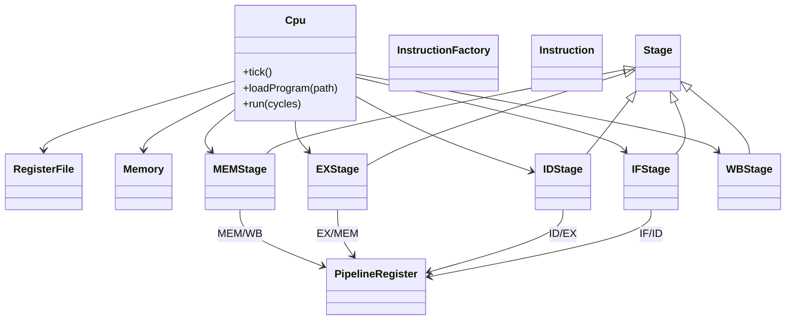

# MIPS Assembly Simulator – Project Overview

# MIPS Assembly Simulator – Project Overview

## 🎯 Current Status (July 31, 2025)

**Sprint 1 Progress**: Core ISA Implementation  
**Tests Passing**: ✅ 17/17 (100%)  
**Implemented Instructions**: ADD, SUB  
**Next Target**: ADDI (I-type immediate arithmetic)

### 📊 Feature Completion
- ✅ **Walking Skeleton** - CMake + Google Test framework
- ✅ **ADD Instruction** - Complete with BDD tests
- ✅ **SUB Instruction** - Complete with BDD tests  
- ✅ **Basic Assembler** - R-type instruction parsing
- 🔄 **Pipeline Infrastructure** - Skeleton ready
- ❌ **Hazard Handling** - Not started
- ❌ **Memory Instructions** - Not started

### 🚀 Quick Start
```powershell
# Build and test
cmake -B build -G "Visual Studio 17 2022"
cmake --build build --config Debug
ctest --test-dir build

# Run CLI simulator
.\build\src\Debug\mips-sim.exe
```

📖 **For detailed development guide**: See [DEVELOPMENT_REPORT.md](DEVELOPMENT_REPORT.md)

---

## 1  Purpose

A cycle‑accurate educational simulator that models the classic 5‑stage MIPS pipeline (IF → ID → EX → MEM → WB).  Students can assemble a small program, execute it step‑by‑step, and inspect registers, memory, and intermediate pipeline registers at each cycle.

**Primary goals**

* Match reference behaviour for a core R/I‑type subset (`add`, `sub`, `addi`, `lw`, `sw`, `beq`, `j`).
* Provide clear, modular C++17 code that is easy to test and extend.
* Achieve >90 % unit‑test line coverage and zero sanitizer findings.

---

## 2  High‑Level Architecture



*Each **`Stage`** owns its functional unit logic; data moves through concrete **`PipelineRegister`** instances managed by **`Cpu`**.*

---

## 3  Pipeline Flow

```mermaid
flowchart TD
    Start[[Start Cycle]]
    IF[Instruction Fetch]
    ID[Instruction Decode & Reg Read]
    EX[Execute / ALU]
    MEM[Memory Access]
    WB[Write Back]
    End[[Commit Cycle]]

    Start --> IF --> ID --> EX --> MEM --> WB --> End
    MEM --|Branch taken| IF
    ID --|Stall on hazard| ID
```

---

## 4  Deliverables

| ID | Artefact            | Description                                                  |
| -- | ------------------- | ------------------------------------------------------------ |
| D1 | **simulator**       | CLI executable `mips-sim` with cycle‑trace output            |
| D2 | **assembler**       | Minimal two‑pass assembler generating binary for simulator   |
| D3 | **unit tests**      | GoogleTest suite covering ISA and pipeline cases             |
| D4 | **behaviour tests** | Cucumber‑cpp Gherkin scenarios acting as acceptance tests    |
| D5 | **docs**            | README, design doc (this file), API docs (Doxygen)           |
| D6 | **CI/CD**           | GitHub Actions pipeline (build, test, sanitizers, packaging) |

---

## 5  Milestones

| Sprint (2025) | Dates          | Goal              | Key tasks                                      |
| ------------- | -------------- | ----------------- | ---------------------------------------------- |
| S0            | Jul 20 – 21    | Bootstrap         | Repo, CMake skeleton, CI hello‑world           |
| S1            | Jul 22 – 28    | Core ISA          | `Instruction`, `RegisterFile`, basic assembler |
| S2            | Jul 29 – Aug 4 | Pipeline skeleton | Stage classes, tick loop, no hazards           |
| S3            | Aug 5 – 11     | Hazards           | Stall, forwarding, branch flush logic          |
| S4            | Aug 12 – 18    | Hardening         | Edge cases, ASan/UBSan, 90 % coverage          |
| S5            | Aug 19 – 24    | Freeze & docs     | Packaging, README, final review                |

---

## 6  Task Breakdown (Kanban‑style)

### 6.1 Core ISA

*

### 6.2 Pipeline Infrastructure

*

### 6.3 Hazard Handling

*

### 6.4 Testing & Tooling

*

### 6.5 Documentation & Packaging

*

---

## 7  Stretch Goals

* Forwarding unit instead of full stall on ALU‑ALU dependency
* Data cache with configurable latency
* Web‑based front‑end via WASM + Svelte

---

## 8  References & Further Reading

1. MIPS ISA reference manual (PDF)
2. Hennessy & Patterson, *Computer Architecture – A Quantitative Approach*
3. GoogleTest documentation (link)
4. Cucumber‑cpp GitHub repository
5. LLVM Address Sanitizer documentation


